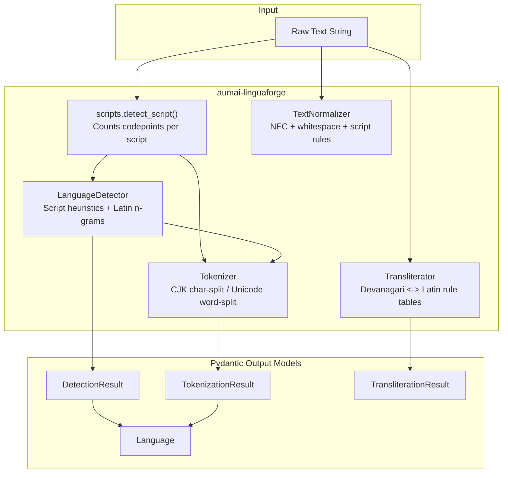

# aumai-linguaforge

**Multi-language NLP toolkit supporting 100+ languages with a strong Indic focus.**

Part of the [AumAI](https://github.com/aumai) open-source agentic AI infrastructure suite.

[](https://github.com/aumai/aumai-linguaforge/actions)
[](https://pypi.org/project/aumai-linguaforge/)
[](LICENSE)

---

## What is LinguaForge?

Imagine you are building an AI assistant that must understand a customer writing in Hindi, then
process a support ticket in Bengali, while your analytics pipeline ingests Spanish social media
posts alongside Japanese product reviews. Every language has its own script, its own punctuation
rules, its own tokenization conventions. Without a unified toolkit you end up stitching together
five different libraries with incompatible APIs and conflicting opinions about what a "token" is.

LinguaForge is that unified toolkit. It provides a single, consistent Python interface for the
four fundamental NLP preprocessing operations — **language detection, tokenization,
transliteration, and text normalization** — across more than 100 languages. It is deliberately
lightweight: no heavy neural models, no GPU requirement, no gigabyte PyTorch dependency. Instead
it uses Unicode character properties, script detection via codepoint ranges, and hand-crafted
rule tables to deliver deterministic, auditable transformations that work fully offline.

The Indic focus is not an afterthought. All 22 Indian Scheduled Languages are first-class
citizens. Devanagari conjuncts are handled correctly. Zero-width joiners and non-joiners are
preserved where they carry meaning (Brahmic ligature control) and stripped where they are noise.
The Devanagari-to-Latin transliteration table follows ITRANS conventions that Indian developers
already know.

---

## Why Does This Matter? (First Principles)

Most NLP pipelines assume ASCII or Latin text. The moment you handle Indic, CJK, RTL, or other
scripts, three problems appear:

**1. Tokenization breaks for non-Latin scripts.**
Space-delimited splitting fails for Hindi (clitics attach to words), Japanese (no spaces), and
Arabic (agglutinative morphology). LinguaForge detects the script and applies the correct
splitting strategy for each writing system.

**2. Silent corruption from missing normalization.**
The Unicode standard has multiple byte representations of visually identical characters. Without
NFC normalization, the string `"नमस्ते"` typed on one keyboard may not equal `"नमस्ते"` typed on
another — even though they look identical on screen. String equality checks and dictionary
lookups silently fail. LinguaForge normalizes first.

**3. Transliteration is a solved problem that everyone re-solves.**
Developers need Devanagari words in Roman letters for URLs, log files, and accessibility labels.
LinguaForge ships a complete ITRANS-inspired table covering all Devanagari vowels, consonants,
matras, and numerals, with no external dependency.

LinguaForge solves all three problems with zero runtime dependencies beyond Pydantic. Every
result is a typed Pydantic model, so your IDE gives you autocomplete, your validation layer gets
a schema, and you never receive an untyped dict from this library.

---

## Architecture



The pipeline always begins with `detect_script`, which counts Unicode codepoints and returns the
dominant writing system. Everything downstream branches on that signal for script-aware behavior.

---

## Features

- **100+ languages** registered in `SUPPORTED_LANGUAGES` with BCP-47 codes, script names, and
  language family metadata.
- **All 22 Indian Scheduled Languages** — Assamese, Bengali, Bodo, Dogri, Gujarati, Hindi,
  Kannada, Kashmiri, Konkani, Maithili, Malayalam, Manipuri, Marathi, Nepali, Odia, Punjabi,
  Sanskrit, Santali, Sindhi, Tamil, Telugu, Urdu — with correct script assignments.
- **Script detection** via Unicode codepoint ranges covering 29 writing systems including all
  major Brahmic scripts, CJK, RTL scripts, Cyrillic, Greek, and Latin.
- **Language detection** with script-to-language heuristics for non-Latin scripts and
  marker-word frequency scoring for Latin-script disambiguation (English, Spanish, French,
  German, Portuguese).
- **Top-k language detection** — ranked candidates with confidence scores, not just the top
  result.
- **Unicode-aware tokenization** with CJK character-by-character splitting, Brahmic whitespace
  and punctuation splitting, and zero-width character boundary handling.
- **Devanagari-to-Latin transliteration** (ITRANS-inspired) covering all vowels (independent
  and matra forms), all 35 consonants, anusvara, visarga, virama, chandrabindu, avagraha, and
  Devanagari digits 0-9.
- **Latin-to-Devanagari transliteration** with longest-match-first substitution to correctly
  handle multi-character sequences like `kha` before `k`.
- **Unicode NFC normalization** with whitespace collapsing, zero-width character cleanup
  (preserving semantically significant ZWJ/ZWNJ), and Devanagari chandrabindu normalization.
- **CLI** with four subcommands: `detect`, `tokenize`, `transliterate`, `normalize`.
- **Fully typed** — every operation returns a `pydantic.BaseModel`, never a raw `dict`.
- **Zero heavy dependencies** — only `pydantic` and `click`.

---

## Installation

```bash
pip install aumai-linguaforge
```

Development install from source:

```bash
git clone https://github.com/aumai/aumai-linguaforge
cd aumai-linguaforge
pip install -e ".[dev]"
```

Requirements: Python 3.11+

---

## Quick Start

```python
from aumai_linguaforge.core import (
    LanguageDetector,
    Tokenizer,
    Transliterator,
    TextNormalizer,
)

# --- Language Detection ---
detector = LanguageDetector()

result = detector.detect("नमस्ते दुनिया")
print(result.language.name)       # Hindi
print(result.language.script)     # Devanagari
print(f"{result.confidence:.0%}") # 90%

# Top-3 candidates for ambiguous Latin-script text
candidates = detector.detect_multiple("el gato es muy bonito", top_k=3)
for c in candidates:
    print(f"{c.language.code}: {c.confidence:.2%}")

# --- Tokenization ---
tokenizer = Tokenizer()

hindi = tokenizer.tokenize("मैं घर जाता हूँ।")
print(hindi.tokens)  # ['मैं', 'घर', 'जाता', 'हूँ', '।']

japanese = tokenizer.tokenize("日本語テスト")
print(japanese.tokens)  # ['日', '本', '語', 'テ', 'ス', 'ト']

# --- Transliteration ---
tr = Transliterator()

latin_result = tr.transliterate("नमस्ते", source_script="Devanagari", target_script="Latin")
print(latin_result.target)   # namasate

back_result = tr.transliterate("namasate", source_script="Latin", target_script="Devanagari")
print(back_result.target)    # नमसते

# --- Text Normalization ---
normalizer = TextNormalizer()

messy = "नमस्ते   दुनिया\u200b"  # extra spaces + zero-width space
clean = normalizer.normalize(messy, language="hi")
print(repr(clean))  # 'नमस्ते दुनिया'
```

---

## CLI Reference

The CLI is installed as the `linguaforge` command.

### `detect` — Identify the language of a file

```bash
linguaforge detect --input myfile.txt
linguaforge detect --input myfile.txt --top-k 3
```

| Option | Type | Default | Description |
|--------|------|---------|-------------|
| `--input` | path | required | UTF-8 text file to analyse |
| `--top-k` | int | `1` | Number of candidate languages to print |

**Output:**

```
hi  Hindi                 confidence=90.00%  script=Devanagari
```

With `--top-k 3` on Latin-script text:

```
en  English               confidence=52.17%  script=Latin
es  Spanish               confidence=28.99%  script=Latin
fr  French                confidence=10.14%  script=Latin
```

---

### `tokenize` — Split text into tokens

```bash
linguaforge tokenize --input myfile.txt
linguaforge tokenize --input myfile.txt --language hi
```

| Option | Type | Default | Description |
|--------|------|---------|-------------|
| `--input` | path | required | UTF-8 text file |
| `--language` | str | auto-detect | BCP-47 code (e.g. `hi`, `ta`, `zh`) |

**Output:**

```
Language: Hindi (hi)
Tokens (5):
मैं | घर | जाता | हूँ | ।
```

---

### `transliterate` — Convert between scripts

```bash
linguaforge transliterate --input hindi.txt --from devanagari --to latin
linguaforge transliterate --input roman.txt  --from latin --to devanagari
```

| Option | Type | Default | Description |
|--------|------|---------|-------------|
| `--input` | path | required | UTF-8 text file |
| `--from` | str | required | Source script name (case-insensitive) |
| `--to` | str | required | Target script name (case-insensitive) |

Supported script pairs: `Devanagari <-> Latin`

---

### `normalize` — Apply Unicode NFC and script-specific rules

```bash
linguaforge normalize --input dirty.txt --language hi
linguaforge normalize --input tamil.txt --language ta
```

| Option | Type | Default | Description |
|--------|------|---------|-------------|
| `--input` | path | required | UTF-8 text file |
| `--language` | str | required | BCP-47 language code |

---

## Python API Examples

### Browsing the language registry

```python
from aumai_linguaforge.core import SUPPORTED_LANGUAGES

# All Dravidian languages
dravidian = [
    lang for lang in SUPPORTED_LANGUAGES.values()
    if lang.family == "Dravidian"
]
for lang in dravidian:
    print(f"{lang.code}: {lang.name} ({lang.script})")
# kn: Kannada (Kannada)
# ml: Malayalam (Malayalam)
# ta: Tamil (Tamil)
# te: Telugu (Telugu)
```

### Building a multilingual processing pipeline

```python
from aumai_linguaforge.core import LanguageDetector, Tokenizer, TextNormalizer

detector = LanguageDetector()
tokenizer = Tokenizer()
normalizer = TextNormalizer()

texts = [
    "Hello world",
    "नमस्ते दुनिया",
    "Bonjour le monde",
    "日本語のテスト",
]

for raw in texts:
    detection = detector.detect(raw)
    lang_code = detection.language.code
    normalized = normalizer.normalize(raw, language=lang_code)
    tokens = tokenizer.tokenize(normalized, language=lang_code)
    print(f"[{lang_code}] {tokens.tokens}")
```

### Batch transliteration

```python
from aumai_linguaforge.core import Transliterator

tr = Transliterator()
words = ["भारत", "नमस्ते", "धन्यवाद", "संस्कृत"]

for word in words:
    result = tr.transliterate(word, source_script="Devanagari", target_script="Latin")
    print(f"{result.source:<12} -> {result.target}")
```

### Extending the language registry

```python
from aumai_linguaforge.core import SUPPORTED_LANGUAGES
from aumai_linguaforge.models import Language

SUPPORTED_LANGUAGES["bho"] = Language(
    code="bho",
    name="Bhojpuri",
    script="Devanagari",
    family="Indo-Aryan",
)
```

---

## How It Works: Deep Dive

### Script Detection

`detect_script` in `scripts.py` iterates every character in the input text, mapping its Unicode
codepoint to a script name using a list of `(start, end, script_name)` range tuples. It tallies
a frequency count per script and returns the most frequent. The 29 ranges cover every major world
writing system. The function is O(n * r) where n is text length and r is the number of ranges
(constant at 29), making it effectively O(n).

### Language Detection

For non-Latin scripts the mapping is deterministic: Devanagari yields Hindi, Bengali yields
Bengali, Hangul yields Korean. Confidence is 0.90 to signal that while script identification is
certain, the specific language within that script may vary (e.g. Devanagari is shared by Hindi,
Marathi, Sanskrit, Nepali, Dogri, Maithili, Bodo, and Konkani).

For Latin-script text, `_latin_heuristics` scores five languages (English, Spanish, French,
German, Portuguese) by counting how many high-frequency function words from each language's
marker list appear in the text. Scores are normalized to sum to 1.0.

### Tokenization

The tokenizer applies two different strategies based on the detected script:

- **CJK / Hiragana / Katakana**: Each non-space character becomes its own token. This is
  linguistically correct for Chinese and Japanese, where word boundaries do not correspond
  to spaces.
- **All other scripts**: `_unicode_tokenize` splits on any run of whitespace and Unicode
  zero-width characters (U+200B, U+200C, U+200D, U+2060, U+FEFF), then performs a secondary
  boundary split between word-class and non-word-class Unicode character categories. This
  correctly handles punctuation attachment in Hindi, Arabic, and Latin-script languages using
  a single code path.

### Transliteration

The Devanagari-to-Latin table is a character-by-character substitution mapping. Latin-to-
Devanagari reverses this mapping, with keys sorted by descending length before substitution to
ensure that `kha` is matched and replaced before `k`.

### Text Normalization

Four ordered steps:
1. **Unicode NFC**: Canonical decomposition then canonical composition for consistent byte
   representation.
2. **Whitespace collapsing**: Multiple spaces or tabs become one. Three or more consecutive
   newlines collapse to two.
3. **Zero-width cleanup**: U+200B, U+2060, U+FEFF, and U+00A0 are removed. U+200C (ZWNJ) and
   U+200D (ZWJ) are intentionally preserved — they control conjunct formation and ligature
   behavior in Brahmic scripts.
4. **Devanagari-specific**: Chandrabindu (U+0901) is normalized to anusvara (U+0902), unifying
   two historically interchangeable representations of nasalization.

---

## Integration with Other AumAI Projects

| Project | Integration |
|---------|-------------|
| **aumai-bharatvaani** | BharatVaani provides deep Indic NLP (sentiment, NER, 22-language focus). Use LinguaForge for broad 100+ language coverage and as a preprocessing layer feeding into BharatVaani. |
| **aumai-voicefirst** | Voice transcripts arrive as raw text strings. Use LinguaForge to normalize and tokenize them before downstream processing. `LanguageDetector` can identify the language of an auto-transcribed utterance when the source language is unknown. |
| **aumai-specs** | All Pydantic models (`Language`, `DetectionResult`, `TokenizationResult`, `TransliterationResult`) are directly serializable to JSON Schema via `model_json_schema()`. Use `aumai-specs` to define and validate contracts across service boundaries. |

---

## Contributing

Contributions are welcome. Please read `CONTRIBUTING.md` before opening a pull request.

- **New language entries**: add to `SUPPORTED_LANGUAGES` in `core.py` and `_SCRIPT_TO_LANG`.
- **New transliteration pairs**: add a mapping table constant and a branch in
  `Transliterator.transliterate`.
- **New script ranges**: update `SCRIPT_RANGES` in `scripts.py`.
- **All new features** require tests in `tests/`.

```bash
make test       # run pytest
make lint       # ruff check
make typecheck  # mypy --strict
```

Branch naming: `feature/`, `fix/`, `docs/` from `main`.

---

## License

Apache License 2.0. See [LICENSE](LICENSE) for the full text.

```
Copyright 2024 AumAI

Licensed under the Apache License, Version 2.0 (the "License");
you may not use this file except in compliance with the License.
You may obtain a copy of the License at

    http://www.apache.org/licenses/LICENSE-2.0

Unless required by applicable law or agreed to in writing, software
distributed under the License is distributed on an "AS IS" BASIS,
WITHOUT WARRANTIES OR CONDITIONS OF ANY KIND, either express or implied.
See the License for the specific language governing permissions and
limitations under the License.
```
